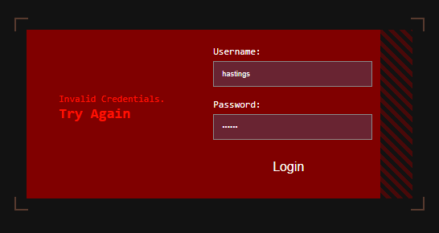
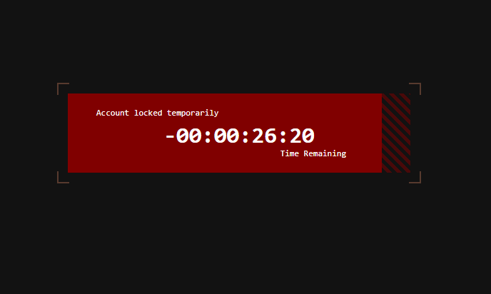

# sign in demo app
A secure, user-friendly, and effective login app using object oriented programming technique.

# Key features:
1. User Interface (UI)
Design:
Clean and Intuitive: The login page is visually appealing and easy to navigate.
Clear Instructions: Provide clear instructions and labels for each field (e.g., "Username or Email").
Form Elements:
Username/Email Field: Allow users to enter their username or email address.
Password Field:
Securely capture the password (e.g., use the "password" input type to mask the input).
Login Button: A prominent button to initiate the login process.

3. User Experience (UX)
Smooth Flow: The login process is be quick and seamless.
Error Handling: Provide clear and helpful error messages (e.g., "Invalid username or password," "Account locked").
Security: Clearly communicate security measures (e.g., data encryption, secure password storage).

3. Backend Functionality
User Authentication:
Validate Credentials: Verify the provided username/email and password against stored user data (e.g., in a database).
Hashing: Store user passwords securely using strong hashing algorithms (e.g., bcrypt) to prevent them from being compromised if the database is breached.
Session Management:
Create a session upon successful login to maintain user state.
Store relevant user information in the session (e.g., user ID, last attempt time).
Security Measures:
Input Validation: Sanitize all user input to prevent security vulnerabilities like SQL injection.
Rate Limiting: Implement measures to limit the number of login attempts to prevent brute-force attacks.

# Key changes:

Session tracking: The number of failed attempts is stored in the session ($_SESSION['failed_attempts']). 
If the user exceeds the maximum allowed attempts, they are locked out for 30 minutes.

Lockout mechanism: A timestamp ($_SESSION['lockout_time']) is recorded when the user is locked out, and login attempts are blocked until 30 minutes have passed.

Countdown timer: The lockout.php page shows a countdown timer that refreshes every second and redirects the user to the login page when the lockout period ends.
With these changes, the application should now protect against brute-force attacks by enforcing a timeout after three failed login attempts.

Security Measures:
-SQL Injection Prevention:
The use of prepared statements ($stmt->prepare()) with bound parameters is a strong protection against SQL injection attacks. 

-Password Security:
Password_hash() and password_verify() to store and verify passwords securely. 
