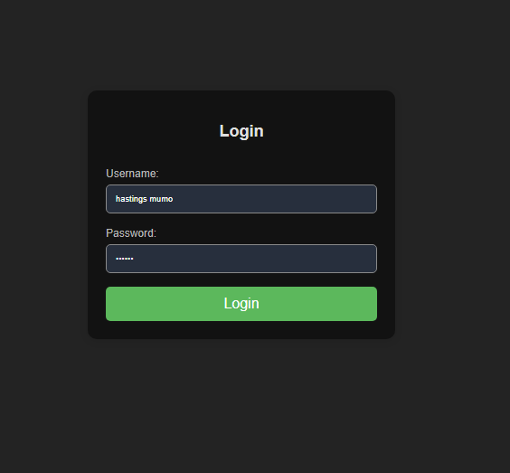

# login-app

A secure, user-friendly, and effective login app 
Key changes:

Session tracking: The number of failed attempts is stored in the session ($_SESSION['failed_attempts']). 
If the user exceeds the maximum allowed attempts, they are locked out for 30 minutes.

Lockout mechanism: A timestamp ($_SESSION['lockout_time']) is recorded when the user is locked out, and login attempts are blocked until 30 minutes have passed.

Countdown timer: The lockout.php page shows a countdown timer that refreshes every second and redirects the user to the login page when the lockout period ends.
With these changes, the application should now protect against brute-force attacks by enforcing a timeout after three failed login attempts.

Current Protections in this Code:
-SQL Injection Prevention:
The use of prepared statements ($stmt->prepare()) with bound parameters is a strong protection against SQL injection attacks. 

-Password Security:
Password_hash() and password_verify() to store and verify passwords securely. 
